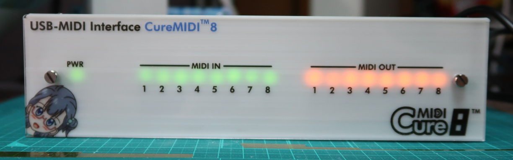
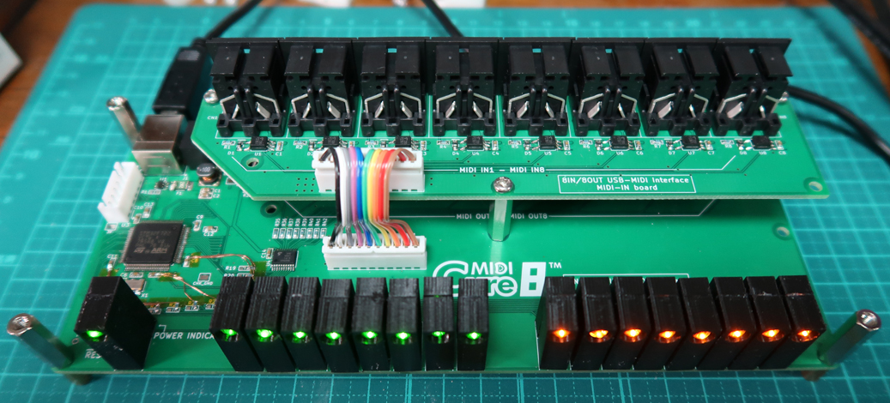

# USB-MIDI Interface (8IN/8OUT) for STM32 "CureMIDI8"

## Overview

This repository shows STM32F7 (ARM Cortex-M7) based  8IN/8OUT USB-MIDI Interface.
It is USB MIDI class-compliant, so you can add MIDI port without drivers(Windows, iOS, Android, etc...)

The USB-MIDI Class Driver is based on [mimuz-tuch](https://github.com/mimuz/mimuz-tuch) project (c) [D.F.Mac. @TripArts Music](https://github.com/tadfmac).

STM32F7を使用した、USB-MIDIインターフェースです。INを8系統、OUTを8系統実装しています。USB MIDI Classに対応するシステム(Windows, iOS, Android, etc.)に対し、ドライバレスでMIDI入出力ポートを追加できます。

USB MIDI Classドライバは、[D.F.Mac. @TripArts Music](https://github.com/tadfmac)氏作成の[ドライバ](https://github.com/mimuz/mimuz-tuch/tree/master/STM32)を元に、I/F部(usbd_midi_if.c/h)の改造を行っています。

## Specifications

* High-Speed MCU (STM32F722VCT)
* USB MIDI class-compliant
* MIDI port: 8IN/8OUT
* MIDI buffer size: 2kB * (8IN+8OUT) = 32kB

## Building Information

### Making hardware

See [Schematic](./hardware/schematic.pdf), [KiCad Source](./hardware/kicad_source).
CureMIDI8 consist of a mainboard and a MIDI-IN board.

回路図は[こちら](./hardware/schematic.pdf).
CureMIDI8は、メイン基板(Mainboard)と、拡張基板(MIDI-IN board)に分かれています。

### Building software

Install [SW4STM32](http://www.openstm32.org/HomePage)(need registration), import [Project files](./software/SW4STM32_project/). If you have successfully imported, you can build the project without error and the binary file will be created in /SW4STM32_project/Debug/.

[SW4STM32](http://www.openstm32.org/HomePage)をインストールし、[プロジェクトファイル](./software/SW4STM32_project/)をインポートして下さい。インポートに成功していれば、SW4STM32上でプロジェクトをビルドするだけで、/SW4STM32_project/Debug/フォルダにバイナリファイルが生成されるはずです。

## How to Porting

Load CureMIDI8.ioc on [STM32CubeMX (Ver.5.0.1)](https://www.st.com/ja/development-tools/stm32cubemx.html), change the pin assignment, and generate code.
After code generation, copy usb device driver as described below. You can use ./click_after_code_generation.bat (in Windows).

CureMIDI8.iocを[STM32CubeMX (Ver.5.0.1)](https://www.st.com/ja/development-tools/stm32cubemx.html)で読みこみ、ポートを適宜修正し、コード生成をして下さい。コードを生成後、./template下のUSBドライバを、下記の通り上書きして下さい。上書きは、./click_after_code_generation.batを実行してもOKです。

* ./template/\*.c => ./Src/\*.c
* ./template/\*.h => ./Inc/\*.h

## File Location

* [Binary file for STM32F722](./software/bin/)
* [STM32CubeMX(5.0.1) Project file](./software/SW4STM32_project/CureMIDI8.ioc)
* [Source codes and project files (System WorkBench for STM32)](./software/SW4STM32_project/)
* [Schematic](./hardware/schematic.pdf)

## NOTICE

### VID/PID

Vendor ID(VID) and Product ID(PID) in <usbd_desc.c> should be unique pair for each USB devices.
Default VID 0x1209 and PID 0x0001 is experimental IDs from [http://pid.codes](http://pid.codes) .When distributing or selling, you must get your own IDs, and change to your own IDs in order to avoid conflicting to other USB devices.

USBのVendor ID(VID)とProduct ID(PID)は、<usbd_desc.c>内に記述します。
デフォルトのVID(0x1209)/PID(0x0001)ペアは、[http://pid.codes](http://pid.codes)で定められている実験用IDです。そのため、本機器を配布したり販売したりする場合には、別途固有のIDペアを取得し、書き換えてご使用いただく必要があります。

## References

### MIDI specification

* [The Complete MIDI 1.0 Detailed Specification](https://www.midi.org/specifications/item/the-midi-1-0-specification) ([MIDI Association](https://www.midi.org/))
* [MIDI1.0規格書](http://amei.or.jp/midistandardcommittee/MIDI1.0.pdf) ([AMEI](http://amei.or.jp/))
* [MIDIの学習](http://www1.plala.or.jp/yuuto/midi/index.html) ([Laboratory "U"](http://www1.plala.or.jp/yuuto/top.html))

### USB-MIDI technical information

* [Universal Serial Bus Device Class Definition for MIDI Devices](http://www.usb.org/developers/docs/devclass_docs/midi10.pdf)
* [USBおよびUSB MIDIについて調べる](http://picmidi.seesaa.net/article/150728556.html) ([PICでMIDI！](http://picmidi.seesaa.net/))

## Copyrights

* USB MIDI Class Driver by [D.F.Mac. @TripArts Music](http://ta-music.strikingly.com/)
* STM32 CubeF7 by [STMicroelectronics](https://www.st.com/en/embedded-software/stm32cubef7.html)

## Author

(c) 2019 Keshikan ( [Website](http://www.keshikan.net/),  [Twitter](https://twitter.com/keshinomi_88pro) )

## License

* USB MIDI Class Driver: [CC BY 4.0](https://creativecommons.org/licenses/by/4.0/)
* STM32 CubeF7: BSD-3-Clause based.
* Other Codes, Hardware, Schematic: [GPLv3](https://www.gnu.org/licenses/gpl-3.0.html)

See also [LICENSE.md](./LICENSE.md)
