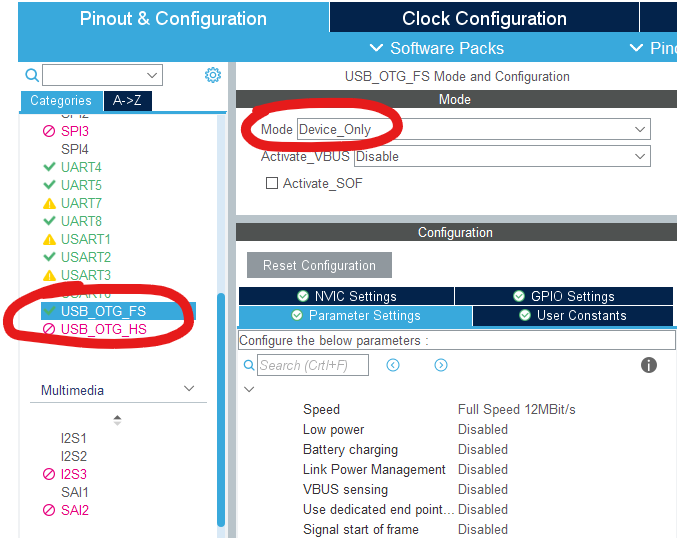
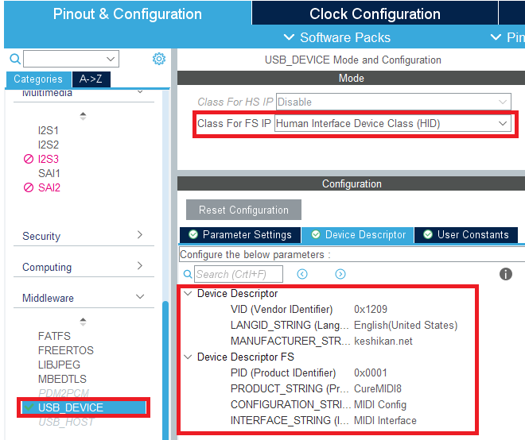
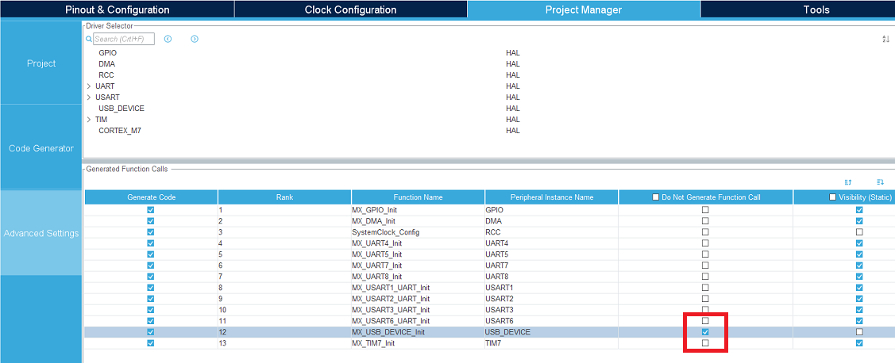
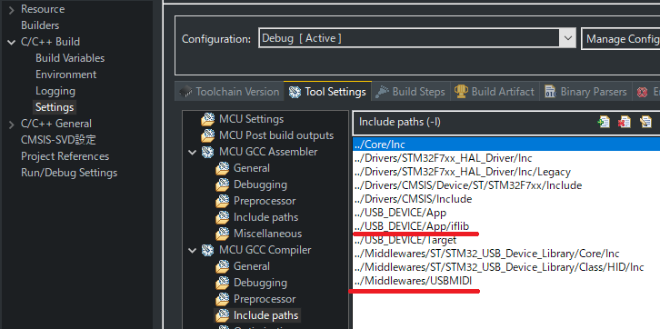

# CureMIDI8 プロジェクトファイル (2021/2/14)

## フォルダ内容

* CubeIDE_project
  * [STM32CubeIDE](https://www.st.com/ja/development-tools/stm32cubeide.html)用のプロジェクトです。
* SW4STM32_project
  * [SW4STM32](http://www.openstm32.org/HomePage)用のプロジェクトです。古いので非推奨。

## CubeIDE_projectフォルダについて

最新の開発環境(2021/2/14現在)に対応させたプロジェクトファイル一式です。以下の環境でビルドと動作確認をしています。

* STM32CubeMX Version 6.1.1
* STM32CubeF7 V1.16.0
* STM32CubeIDE Version 1.5.1
* Windows10 20H2

## ポーティング手順

既存のCubeMX+CubeIDEのプロジェクトに対し、本プロジェクトのUSB-MIDIドライバを組み込むための手順を示します。今のところ、以下のMCU(括弧内はライブラリVer)で実績があります。

* STM32F722VC(STM32CubeF7 V1.16.0)
* STM32F407VG(STM32CubeF4 V1.25.2)

### CubeMXの設定

* USB_OTG_FSをDevice_Onlyに設定する。

  * 

* USB_DEVICEで、Human Interface Device Class(HID)を選び、Device Descriptorを画像のように設定する。必要に応じて書き換える。(VID/PIDは実験用なので、他のIDに書き換えることを推奨)

  * 

* Project ManagerタブのAdvanced Settingsを開き、MX_USB_DEVICE_Initの行の"Do Not Generate Function Call"チェックボックスをONにする。

  * 

### ファイルのコピー

お使いのプロジェクトに、以下のファイルをコピーする。

* Middlewares/USB-MIDI フォルダ一式
* USB_DEVICE/App/iflib フォルダ一式
* USB_DEVICE/Appのusbd_device.c/hを、本リポジトリのもので上書き

### CubeIDEの設定その他

* 以下でincludeされている「stmf7**.h」をMCUに合わせて書き直す。例：STM32F4にポーティングするなら、f7→f4にする。
  * /USB_DEVICE/App/usb_device.h
  * /USB_DEVICE/App/iflib/usbd_midi_if.h
  * /Middlewares/USBMIDI/usbd_midi.h
* プロジェクトのプロパティを開き、インクルードパスに以下を追加する。
  * ../Middlewares/USBMIDI
  * ../USB_DEVICE/App/iflib
  * 

## 使い方

* MIDIのポート数設定：/Middlewares/USBMIDI/にあるusbd_midi.c/h
  * ヘッダ内の定義を変えるだけでポート数が変更できる！･･･という訳では無いので注意(要改善)
  * 変更する際は、usbd_midi.c内のDevice Configuration Descriptorを正しく記述する必要がある。詳細は、[USB MIDI Devices 1.0(仕様書)](https://usb.org/sites/default/files/midi10.pdf)や、[こちらのページ](https://pcm1723.hateblo.jp/entry/20150106/1420519745)を参照
* usbd_midi_if.h, usb_device.hをinclude
* 初期化：MX_USB_MIDI_INIT();とmidiInit();
* (以下追記中。サンプルを見た方が早いかも)
